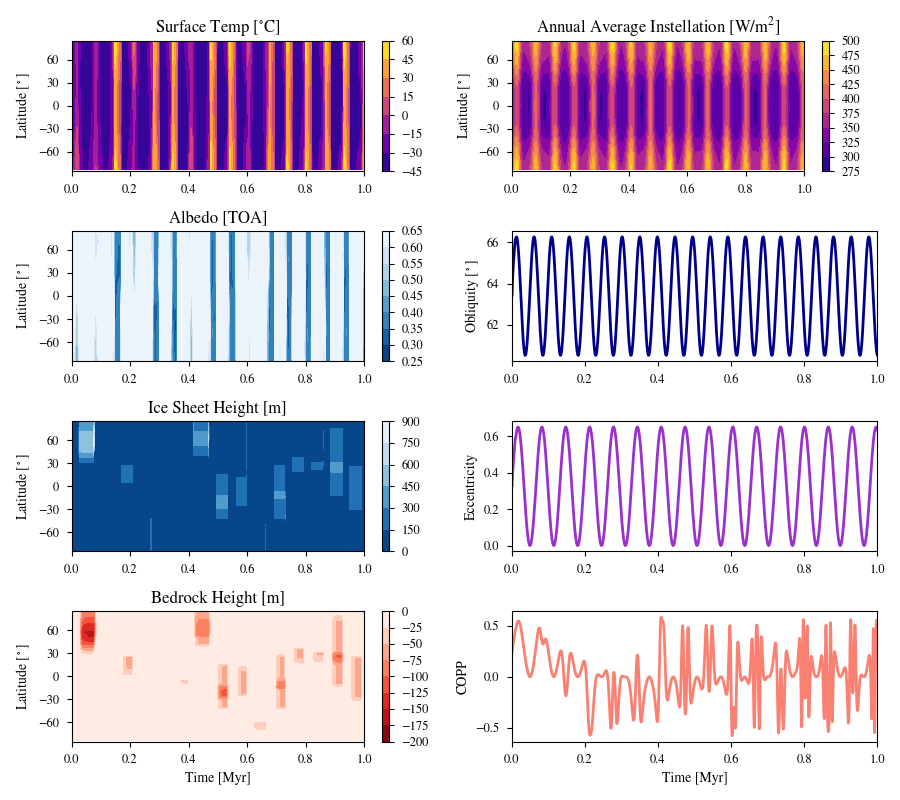

# Chaotic Example

This plot shows a simulation in which a planet orbiting an F dwarf star evolves chaotically, with epochs of both equitorial and polar ice. _Top left:_ Surface temperature. _Top middle left:_ Top of atmosphere albedo. _Bottom middle left:_ Ice sheet height. _Bottom left:_ Bedrock depression (note the negative scale). _Top right:_ Annual average instellation. _Top middle right:_ Obliquity. _Bottom middle right:_ Eccentricity. _Bottom right:_ Climate obliquity precession parameter (COPP).

Below is a table of inital values for the case:

| Parameter              | Initial Value |
| ---------------------- | ------------- |
| Instellation           | 0.9953        |
| Obliquity              | 63.39         |
| Obliquity Amplitude    | 5.743         |
| Obliquity Period       | 48192         |
| Eccentricity           | 0.326         |
| Eccentricity Amplitude | 0.650         |
| Eccentricity Period    | 65292         |

This figure uses bigplanet's single simulation extraction process and assumes the simulations in the [DynamicCases](../DynamicCases) have already been completed. The first step is to extract the desired simulation from the _archive file or raw data XXX_ by running bigplanet: _XXX bpl.in is not in the repo!_

```
bigplanet bpl.in
```

This will generate a bpf file called _ChaoticExample.bpf_ that contains the data needed for this figure. To create the figure, execute the following command in the command line:

```
python makeplot.py <pdf | png>
```

where the two arguments after makeplot.py set the output to either a pdf or png. The resultant plot should should look like this:


