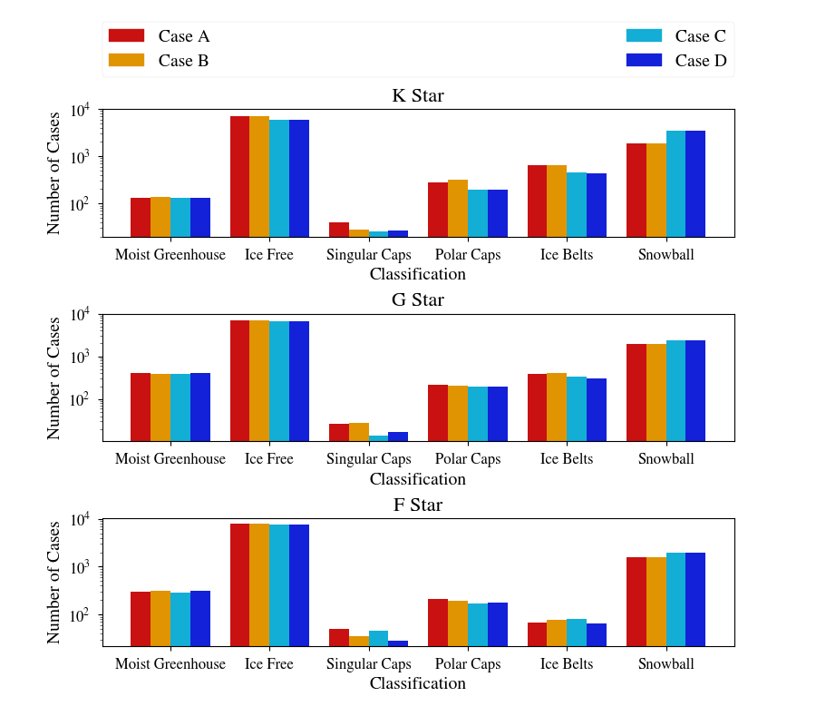

# Dynamic Case Comparison

This plot shows the outcomes of our 5 [Dynamic Cases](../DynamicCases), grouped by host star spectral type. See the paper for more information on the differencs between these cases. Despite wide ranges of assumptions, the outcomes are relatively constant, suggesting that variations in albedo, rotational cycle, or orbital cycle do not strongly influence the climate states.

.. note:: 

    These instructions assume you have completed the [Dynamic Cases](../DynamicCases) and have build the bigplanet archive.

To categorize the planets, type the following:

```
python climate_type.py [FolderName]

```

which generates a file called climateType.log that tabulates the different categories of ice state. To generate the figure, type the following code:

```
python makeplot.py <pdf | png>
```

This should generate the plot:



The numbers in the  file should match that of the numbers in the figure

.. note::

    The exact values in your reproduction may vary slightly (1%) due to differences in random number generation.