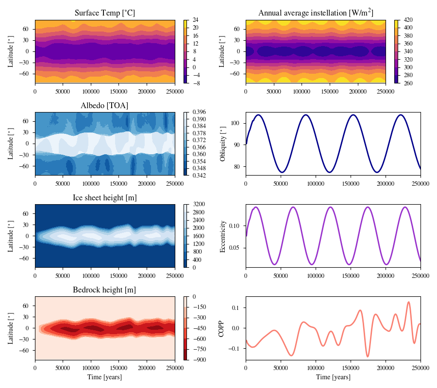

# Dynamic Evolution Example

This plot shows a stable Icebelt from the Dynamic Cases, specifically the Case A G Dwarf. *Top left:* Surface temperature. *Top middle left:* Top of atmosphere albedo. *Bottom middle left:* Ice sheet height. *Bottom left:* Bedrock height (note the negative scale). *Top right:* Annual average instellation. *Top middle right:* Obliquity. *Bottom middle right:* Eccentricity. *Bottom right:* Climate obliquity precession parameter (COPP).

Below is a table of inital values for the case:

| Parameter              | Initial Value  |
|------------------------|----------------|
| Instellation           | 0.9405         |
| Obliquity              | 90.5           |
| Obliquity Amplitude    | 26.5           |
| Obliquity Period       | 53,325         |
| Eccentricity           | 0.077          |
| Eccentricity Amplitude | 0.129          |
| Eccentricity Period    | 44656          |

To generate the plot, run the following code in the command line:
```
vplanet vpl.in
python makeplot.py <pdf | png>
```

This should generate the following plot:


