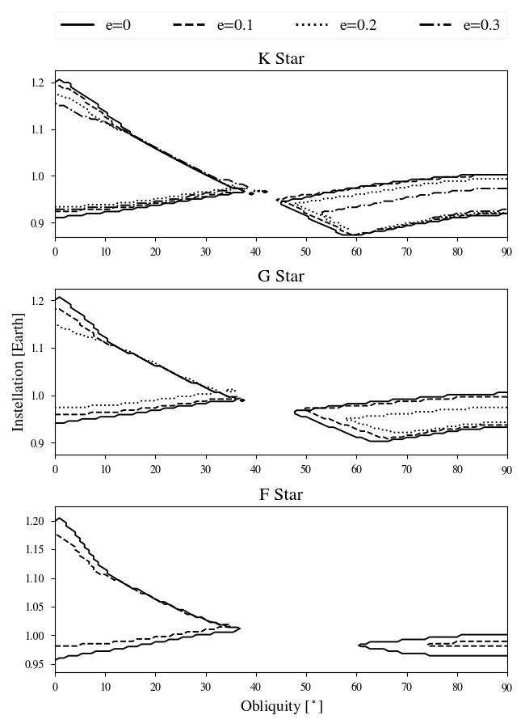

# Eccentricity Comparison

This plot shows the comparisons of ice belt regimes for planets orbiting K (top), G (middle), and F (bottom) as a function of eccentricity, with e = 0 solid, e = 0.1 dashed, e = 0.2 dotted, and e = 0.3 dash-dotted. Ice belts are unstable at e > 0.3 for G star planets and e > 0.1 for F star planets, thus the respective curves are omitted.

Prior to generating the plot, the simulations the following cases need to be completed, all of which are in the `StaticCases/` directory:

KStar/WarmStart
Kstar/Ecc01
Kstar/Ecc02
Kstar/Ecc03
Kstar/Ecc04

GStar/WarmStart
GStar/Ecc01
GStar/Ecc02

FStar/WarmStart
FStar/Ecc01

To run each of the parameter sweeps, cd into the directory and type the following:

```
vspace vspace.in
```

This generates the 10,000 test cases that generates the figure. After that run multiplanet to run the simulations by typing the following:

```
multiplanet vspace.in.
```

Once each of the simulations is completed (this will take some time), run bigplanet in each of the directories with the following:

```
bigplanet bpl.in -a
```

This generates a bigplanet archive file which is where all the data is stored from the simulations.
Finally, once that is done, come back to this directory and generate the plot with the following:

```
python makeplot.py <pdf | png>
```

This should generate the plot:


