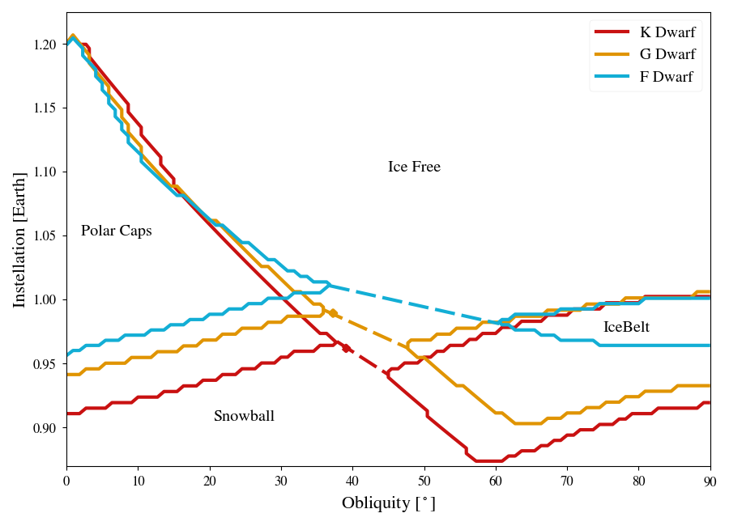

# Static Comparison

This directory shows how to plot the comparison of the final ice states for planets with warm start planets and circular orbits for F (lightblue), G (orange), and K (red) host stars, with each region is labeled accordingly.  The dashed lines between the cap and beltregions are the approximate location of the boundary between snowball and ice free ice states.

#### _These instructions assume you have completed the [Static Cases](../StaticCases) and have built the bigplanet archive._

To generate the plot, type the following code:
```
python makeplot.py <pdf | png>
```
where the two arguments after makeplot.py set the output to either a pdf or png. This command will generate the following plot:


